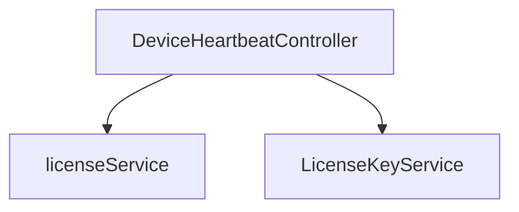
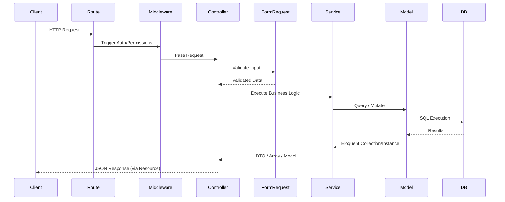

# PHASE 3 — ROUTES + CONTROLLERS + SERVICES EXTRACTION

## 1. ROUTES

| Method | URI | Controller@Action | Middleware | Permission |
|---|---|---|---|---|
| POST | `/login` | AuthController@login | Inherited from group | Inherited/None |
| POST | `/password/forgot` | \App\Domain\IAM\Controllers\PasswordResetController@sendResetLink | Inherited from group | Inherited/None |
| POST | `/password/verify-otp` | \App\Domain\IAM\Controllers\PasswordResetController@verifyOtp | Inherited from group | Inherited/None |
| POST | `/password/reset` | \App\Domain\IAM\Controllers\PasswordResetController@resetPassword | Inherited from group | Inherited/None |
| POST | `/register/self` | \App\Domain\Tenant\Controllers\RegistrationController@registerSelf | Inherited from group | Inherited/None |
| POST | `/register/accept-invite` | \App\Domain\IAM\Controllers\InvitationController@acceptInvite | Inherited from group | Inherited/None |
| POST | `/webhooks/stripe` | \App\Domain\Tenant\Controllers\SubscriptionController@handleStripeWebhook | Inherited from group | Inherited/None |
| GET | `/tenant/resolve/{subdomain}` | \App\Domain\Tenant\Controllers\PublicTenantController@resolveSubdomain | Inherited from group | Inherited/None |
| POST | `/devices/heartbeat` | \App\Domain\Tenant\Controllers\DeviceHeartbeatController@heartbeat | Inherited from group | Inherited/None |
| POST | `/devices/status` | \App\Domain\Tenant\Controllers\DeviceHeartbeatController@status | Inherited from group | Inherited/None |
| POST | `/logout` | AuthController@logout | Inherited from group | Inherited/None |
| GET | `/me` | AuthController@me | Inherited from group | Inherited/None |
| GET | `/` | \App\Domain\IAM\Controllers\ProfileController@getProfile | Inherited from group | Inherited/None |
| PUT | `/` | \App\Domain\IAM\Controllers\ProfileController@updateProfile | Inherited from group | Inherited/None |
| POST | `/update` | \App\Domain\IAM\Controllers\ProfileController@update | Inherited from group | Inherited/None |
| POST | `/password` | \App\Domain\IAM\Controllers\ProfileController@changePassword | Inherited from group | Inherited/None |
| POST | `/avatar` | \App\Domain\IAM\Controllers\ProfileController@updateAvatar | Inherited from group | Inherited/None |
| GET | `/activities` | \App\Domain\IAM\Controllers\ProfileController@getActivities | Inherited from group | Inherited/None |
| PUT | `/preferences` | \App\Domain\IAM\Controllers\ProfileController@updatePreferences | Inherited from group | Inherited/None |
| POST | `/2fa/enable` | \App\Domain\IAM\Controllers\TwoFactorController@enable | Inherited from group | Inherited/None |
| POST | `/2fa/verify` | \App\Domain\IAM\Controllers\TwoFactorController@verify | Inherited from group | Inherited/None |
| POST | `/2fa/disable` | \App\Domain\IAM\Controllers\TwoFactorController@disable | Inherited from group | Inherited/None |
| GET | `/notifications` | \App\Domain\Tenant\Controllers\NotificationController@index | Inherited from group | Inherited/None |
| PUT | `/notifications/read-all` | \App\Domain\Tenant\Controllers\NotificationController@markAllAsRead | Inherited from group | Inherited/None |
| PUT | `/notifications/{id}/read` | \App\Domain\Tenant\Controllers\NotificationController@markAsRead | Inherited from group | Inherited/None |
| GET | `/announcements` | \App\Domain\Tenant\Controllers\AnnouncementController@index | Inherited from group | Inherited/None |
| POST | `/messages/bulk` | \App\Domain\Tenant\Controllers\NotificationController@sendBulk | Inherited from group | Inherited/None |
| GET | `/devices` | \App\Domain\IAM\Controllers\DeviceController@index | Inherited from group | Inherited/None |
| PUT | `/devices/{id}/block` | \App\Domain\IAM\Controllers\DeviceController@block | Inherited from group | Inherited/None |
| DELETE | `/devices/{id}` | \App\Domain\IAM\Controllers\DeviceController@destroy | Inherited from group | Inherited/None |
| GET | `/tickets` | \App\Domain\Support\Controllers\TicketController@index | Inherited from group | Inherited/None |
| POST | `/tickets` | \App\Domain\Support\Controllers\TicketController@store | Inherited from group | Inherited/None |
| GET | `/tickets/{id}` | \App\Domain\Support\Controllers\TicketController@show | Inherited from group | Inherited/None |
| POST | `/tickets/{id}/reply` | \App\Domain\Support\Controllers\TicketController@reply | Inherited from group | Inherited/None |
| PUT | `/tickets/{id}/status` | \App\Domain\Support\Controllers\TicketController@updateStatus | Inherited from group | Inherited/None |
| POST | `/user/language` | \App\Domain\Tenant\Controllers\SettingsController@updateLanguage | Inherited from group | Inherited/None |
| POST | `/tenant/activate-license` | \App\Domain\Tenant\Controllers\LicenseController@activateTenantLicense | Inherited from group | Inherited/None |
| POST | `/superadmin/impersonate/{tenant_id}/{user_id?}` | \App\Domain\IAM\Controllers\ImpersonationController@impersonate | Inherited from group | Inherited/None |
| POST | `/superadmin/branding` | \App\Domain\Tenant\Controllers\SuperAdminSettingsController@updateBranding | Inherited from group | Inherited/None |
| POST | `/superadmin/announcements` | \App\Domain\Tenant\Controllers\AnnouncementController@createGlobal | Inherited from group | Inherited/None |
| GET | `/monitoring` | \App\Domain\Tenant\Controllers\SuperAdminTelemetryController@monitoring | Inherited from group | Inherited/None |
| GET | `/audit-logs` | \App\Domain\Tenant\Controllers\SuperAdminTelemetryController@auditLogs | Inherited from group | Inherited/None |
| GET | `/email-logs` | \App\Domain\Tenant\Controllers\SuperAdminTelemetryController@emailLogs | Inherited from group | Inherited/None |
| GET | `/licenses` | \App\Domain\Tenant\Controllers\SuperAdminTelemetryController@licenses | Inherited from group | Inherited/None |
| POST | `/licenses/generate` | \App\Domain\Tenant\Controllers\SuperadminController@generateLicense | Inherited from group | Inherited/None |
| GET | `/approvals` | \App\Domain\Tenant\Controllers\SuperAdminTelemetryController@approvals | Inherited from group | Inherited/None |
| GET | `/overview-stats` | \App\Domain\Tenant\Controllers\SuperadminController@overviewStats | Inherited from group | Inherited/None |
| GET | `/dashboard-overview` | \App\Domain\SuperAdmin\Controllers\DashboardOverviewController@getOverview | Inherited from group | Inherited/None |
| GET | `/businesses` | \App\Domain\Tenant\Controllers\SuperadminController@businesses | Inherited from group | Inherited/None |
| POST | `/businesses` | \App\Domain\Tenant\Controllers\SuperadminController@storeBusiness | Inherited from group | Inherited/None |
| DELETE | `/businesses/{id}` | \App\Domain\Tenant\Controllers\SuperadminController@destroyBusiness | Inherited from group | Inherited/None |
| POST | `/businesses/{id}/toggle` | \App\Domain\Tenant\Controllers\SuperadminController@toggleStatus | Inherited from group | Inherited/None |
| GET | `/businesses/{id}/export` | \App\Domain\Tenant\Controllers\SuperadminController@exportBusinessData | Inherited from group | Inherited/None |
| PUT | `/businesses/{id}/modules` | \App\Domain\Tenant\Controllers\SuperadminController@updateModules | Inherited from group | Inherited/None |
| POST | `/businesses/{id}/subscription/renew` | \App\Domain\Tenant\Controllers\SuperadminController@renewSubscription | Inherited from group | Inherited/None |
| POST | `/businesses/{id}/subscription/override` | \App\Domain\Tenant\Controllers\SuperadminController@overrideSubscription | Inherited from group | Inherited/None |
| GET | `/plans` | \App\Domain\Tenant\Controllers\SubscriptionController@getPlans | Inherited from group | Inherited/None |
| POST | `/plans` | \App\Domain\Tenant\Controllers\SubscriptionController@storePlan | Inherited from group | Inherited/None |
| PUT | `/plans/{id}` | \App\Domain\Tenant\Controllers\SubscriptionController@updatePlan | Inherited from group | Inherited/None |
| DELETE | `/plans/{id}` | \App\Domain\Tenant\Controllers\SubscriptionController@destroyPlan | Inherited from group | Inherited/None |
| GET | `/smtp-settings` | \App\Domain\Tenant\Controllers\EmailLogController@getSmtpSettings | Inherited from group | Inherited/None |
| POST | `/smtp-settings` | \App\Domain\Tenant\Controllers\EmailLogController@saveSmtpSettings | Inherited from group | Inherited/None |
| POST | `/smtp-settings/test` | \App\Domain\Tenant\Controllers\EmailLogController@testSmtp | Inherited from group | Inherited/None |
| GET | `/backups` | \App\Domain\Tenant\Controllers\BackupController@index | Inherited from group | Inherited/None |
| POST | `/backups/run` | \App\Domain\Tenant\Controllers\BackupController@runBackup | Inherited from group | Inherited/None |
| POST | `/backups/download` | \App\Domain\Tenant\Controllers\BackupController@download | Inherited from group | Inherited/None |
| GET | `/currencies` | \App\Domain\Tenant\Controllers\SettingsController@currencies | Inherited from group | Inherited/None |
| GET | `/exchange-rates` | \App\Domain\Tenant\Controllers\SettingsController@exchangeRates | Inherited from group | Inherited/None |
| POST | `/exchange-rates/update` | \App\Domain\Tenant\Controllers\SettingsController@updateExchangeRates | Inherited from group | Inherited/None |
| POST | `/exchange-rates/set` | \App\Domain\Tenant\Controllers\SettingsController@setExchangeRate | Inherited from group | Inherited/None |
| POST | `/business/invites` | \App\Domain\IAM\Controllers\InvitationController@sendInvite | Inherited from group | Inherited/None |
| POST | `/business/branding` | \App\Domain\Tenant\Controllers\BusinessSettingsController@updateBranding | Inherited from group | Inherited/None |
| POST | `/business/announcements` | \App\Domain\Tenant\Controllers\AnnouncementController@createTenant | Inherited from group | Inherited/None |
| GET | `/hr/employees` | \App\Domain\HR\Controllers\HRController@employees | Inherited from group | Inherited/None |
| PUT | `/hr/employees/{id}/profile` | \App\Domain\HR\Controllers\HRController@updateEmployeeProfile | Inherited from group | Inherited/None |
| GET | `/hr/attendance` | \App\Domain\HR\Controllers\HRController@getAttendance | Inherited from group | Inherited/None |
| PUT | `/hr/attendance/{id}` | \App\Domain\HR\Controllers\HRController@updateAttendance | Inherited from group | Inherited/None |
| GET | `/hr/payrolls` | \App\Domain\HR\Controllers\HRController@payrolls | Inherited from group | Inherited/None |
| POST | `/hr/payrolls/generate` | \App\Domain\HR\Controllers\HRController@generatePayroll | Inherited from group | Inherited/None |
| POST | `/hr/payrolls/{id}/pay` | \App\Domain\HR\Controllers\HRController@payPayroll | Inherited from group | Inherited/None |
| GET | `/` | \App\Domain\Tenant\Controllers\SettingsController@index | Inherited from group | Inherited/None |
| POST | `/business` | \App\Domain\Tenant\Controllers\SettingsController@updateBusiness | Inherited from group | Inherited/None |
| GET | `/branding` | \App\Domain\Tenant\Controllers\SettingsController@getBranding | Inherited from group | Inherited/None |
| PUT | `/branding` | \App\Domain\Tenant\Controllers\SettingsController@updateBranding | Inherited from group | Inherited/None |
| GET | `/communications` | \App\Domain\Tenant\Controllers\SettingsController@getCommunicationSettings | Inherited from group | Inherited/None |
| PUT | `/communications` | \App\Domain\Tenant\Controllers\SettingsController@updateCommunicationSettings | Inherited from group | Inherited/None |
| POST | `/communications/smtp-test` | \App\Domain\Tenant\Controllers\SettingsController@testSmtpConnection | Inherited from group | Inherited/None |
| GET | `/subscription` | \App\Domain\Tenant\Controllers\SubscriptionController@currentSubscription | Inherited from group | Inherited/None |
| POST | `/subscription/subscribe` | \App\Domain\Tenant\Controllers\SubscriptionController@subscribe | Inherited from group | Inherited/None |
| GET | `/subscription/billing-portal` | \App\Domain\Tenant\Controllers\SubscriptionController@billingPortal | Inherited from group | Inherited/None |
| GET | `/plans` | \App\Domain\Tenant\Controllers\SubscriptionController@getPlans | Inherited from group | Inherited/None |
| GET | `/roles` | \App\Domain\IAM\Controllers\RoleController@index | Inherited from group | Inherited/None |
| POST | `/roles` | \App\Domain\IAM\Controllers\RoleController@store | Inherited from group | Inherited/None |
| GET | `/permissions` | \App\Domain\IAM\Controllers\RoleController@permissions | Inherited from group | Inherited/None |
| POST | `/devices/activate` | \App\Domain\Tenant\Controllers\DeviceHeartbeatController@activatePosDevice | Inherited from group | Inherited/None |
| GET | `/devices` | \App\Domain\Tenant\Controllers\DeviceHeartbeatController@getDevices | Inherited from group | Inherited/None |
| DELETE | `/devices/{id}` | \App\Domain\Tenant\Controllers\DeviceHeartbeatController@revokeDevice | Inherited from group | Inherited/None |
| POST | `/hr/attendance/clock-in` | \App\Domain\HR\Controllers\HRController@clockIn | Inherited from group | Inherited/None |
| POST | `/hr/attendance/clock-out` | \App\Domain\HR\Controllers\HRController@clockOut | Inherited from group | Inherited/None |
| GET | `products/alternatives` | \App\Domain\Catalog\Controllers\ProductController@genericAlternatives | module:pharmacy | Inherited/None |
| GET | `products/warranty-check` | \App\Domain\Sales\Controllers\RMAController@warrantyCheck | Inherited from group | Inherited/None |
| POST | `products/print-labels` | \App\Domain\Catalog\Controllers\ProductController@printLabels | Inherited from group | Inherited/None |
| GET | `/inventory/stock` | \App\Domain\Inventory\Controllers\InventoryController@stock | Inherited from group | Inherited/None |
| POST | `/inventory/adjust` | \App\Domain\Inventory\Controllers\InventoryController@adjustStock | Inherited from group | Inherited/None |
| POST | `/inventory/transfer` | \App\Domain\Inventory\Controllers\InventoryController@transferStock | Inherited from group | Inherited/None |
| GET | `/inventory/low-stock` | \App\Domain\Inventory\Controllers\InventoryController@lowStock | Inherited from group | Inherited/None |
| GET | `/inventory/transfers` | \App\Domain\Inventory\Controllers\StockTransferController@index | Inherited from group | Inherited/None |
| POST | `/inventory/transfers` | \App\Domain\Inventory\Controllers\StockTransferController@store | Inherited from group | Inherited/None |
| GET | `/inventory/transfers/{id}` | \App\Domain\Inventory\Controllers\StockTransferController@show | Inherited from group | Inherited/None |
| PUT | `/inventory/transfers/{id}/status` | \App\Domain\Inventory\Controllers\StockTransferController@updateStatus | Inherited from group | Inherited/None |
| GET | `/register/status` | \App\Domain\Sales\Controllers\RegisterController@status | Inherited from group | Inherited/None |
| POST | `/register/open` | \App\Domain\Sales\Controllers\RegisterController@open | Inherited from group | Inherited/None |
| POST | `/register/close` | \App\Domain\Sales\Controllers\RegisterController@close | Inherited from group | Inherited/None |
| GET | `/rma` | \App\Domain\Sales\Controllers\RMAController@index | Inherited from group | Inherited/None |
| POST | `/rma` | \App\Domain\Sales\Controllers\RMAController@store | Inherited from group | Inherited/None |
| PUT | `/rma/{id}/status` | \App\Domain\Sales\Controllers\RMAController@updateStatus | Inherited from group | Inherited/None |
| GET | `/sales` | \App\Domain\Sales\Controllers\AdvancedSalesController@index | Inherited from group | Inherited/None |
| POST | `/sales/{id}/email` | \App\Domain\Sales\Controllers\TransactionController@sendEmail | Inherited from group | Inherited/None |
| POST | `/sales/return` | \App\Domain\Sales\Controllers\AdvancedSalesController@sellReturn | Inherited from group | Inherited/None |
| POST | `/checkout` | \App\Domain\Sales\Controllers\TransactionController@checkout | Inherited from group | Inherited/None |
| POST | `/checkout/hold` | \App\Domain\Sales\Controllers\TransactionController@holdTransaction | Inherited from group | Inherited/None |
| GET | `/checkout/held` | \App\Domain\Sales\Controllers\TransactionController@heldTransactions | Inherited from group | Inherited/None |
| DELETE | `/checkout/held/{id}` | \App\Domain\Sales\Controllers\TransactionController@deleteHeld | Inherited from group | Inherited/None |
| GET | `/reports/dashboard` | \App\Domain\Reporting\Controllers\ReportController@dashboardKPIs | Inherited from group | Inherited/None |
| GET | `/reports/eod` | \App\Domain\Reporting\Controllers\ReportController@endOfDayReport | Inherited from group | Inherited/None |
| GET | `/reports/profit-loss` | \App\Domain\Reporting\Controllers\ReportController@profitLoss | Inherited from group | Inherited/None |
| GET | `/reports/payroll-vs-revenue` | \App\Domain\Reporting\Controllers\ReportController@payrollVsRevenue | Inherited from group | Inherited/None |
| GET | `/reports/sales` | \App\Domain\Reporting\Controllers\ReportController@salesReport | Inherited from group | Inherited/None |
| GET | `/reports/sales/export` | \App\Domain\Reporting\Controllers\ReportController@exportSales | Inherited from group | Inherited/None |
| GET | `/invoices/{id}` | \App\Domain\Reporting\Controllers\InvoiceController@show | Inherited from group | Inherited/None |
| GET | `/invoices/{id}/print` | \App\Domain\Reporting\Controllers\InvoiceController@printView | Inherited from group | Inherited/None |
| POST | `/auth/login` | AuthController@login | Inherited from group | Inherited/None |
| POST | `/auth/logout` | AuthController@logout | Inherited from group | Inherited/None |
| GET | `/auth/me` | AuthController@me | Inherited from group | Inherited/None |
| GET | `/sync/products` | \App\Domain\Catalog\Controllers\ProductController@index | Inherited from group | Inherited/None |
| POST | `/sync/push` | \App\Domain\Sales\Controllers\TransactionController@syncPush | Inherited from group | Inherited/None |
| GET | `/sanctum/csrf-cookie` | CsrfCookieController@show | Inherited from group | Inherited/None |

## 2. CONTROLLERS

### `Controller`
- **Methods:** None
- **Services Called:** None
- **Models Used directly:** None

### `HealthController`
- **Methods & Validators:**
  - `__invoke`
- **Services Called:** None
- **Models Used directly:** None

### `ExpenseCategoryController`
- **Methods & Validators:**
  - `index`
  - `store`
  - `destroy`
- **Services Called:** None
- **Models Used directly:** None

### `ExpenseController`
- **Methods & Validators:**
  - `index`
  - `store`
  - `update`
  - `destroy`
- **Services Called:** None
- **Models Used directly:** None

### `BrandController`
- **Methods & Validators:**
  - `index`
  - `store`
  - `show`
  - `update`
  - `destroy`
- **Services Called:** None
- **Models Used directly:** Product, Brand

### `CategoryController`
- **Methods & Validators:**
  - `index`
  - `store`
  - `show`
  - `update`
  - `destroy`
- **Services Called:** None
- **Models Used directly:** Category, Product

### `ProductController`
- **Methods & Validators:**
  - `index`
  - `store`
  - `update`
  - `show`
  - `printLabels`
  - `getAvailableSerials`
  - `checkWarranty`
  - `genericAlternatives`
- **Services Called:** None
- **Models Used directly:** Product

### `ContactController`
- **Methods & Validators:**
  - `index`
  - `store`
  - `show`
  - `update`
  - `destroy`
- **Services Called:** None
- **Models Used directly:** Contact

### `LedgerController`
- **Methods & Validators:**
  - `index`
  - `summary`
  - `receivePayment`
  - `dueCustomers`
  - `sendReminder`
- **Services Called:** None
- **Models Used directly:** None

### `HRController`
- **Methods & Validators:**
  - `employees`
  - `updateEmployeeProfile`
  - `clockIn`
  - `clockOut`
  - `getAttendance`
  - `updateAttendance`
  - `payrolls`
  - `generatePayroll`
  - `payPayroll`
- **Services Called:** None
- **Models Used directly:** Carbon, EmployeeProfile, Payroll, User, Attendance

### `AuthController`
- **Methods & Validators:**
  - `login`
  - `logout`
  - `me`
- **Services Called:** None
- **Models Used directly:** User

### `DeviceController`
- **Methods & Validators:**
  - `index`
  - `block`
  - `destroy`
- **Services Called:** None
- **Models Used directly:** None

### `ImpersonationController`
- **Methods & Validators:**
  - `impersonate`
- **Services Called:** None
- **Models Used directly:** Business, User

### `InvitationController`
- **Methods & Validators:**
  - `sendInvite`
  - `acceptInvite`
- **Services Called:** None
- **Models Used directly:** User

### `PasswordResetController`
- **Methods & Validators:**
  - `sendResetLink`
  - `verifyOtp`
  - `resetPassword`
- **Services Called:** None
- **Models Used directly:** None

### `ProfileController`
- **Methods & Validators:**
  - `getProfile`
  - `updateProfile`
  - `changePassword`
  - `updateAvatar`
  - `getActivities`
  - `updatePreferences`
  - `update`
- **Services Called:** None
- **Models Used directly:** None

### `RoleController`
- **Methods & Validators:**
  - `index`
  - `store`
  - `permissions`
- **Services Called:** None
- **Models Used directly:** Role

### `TwoFactorController`
- **Methods & Validators:**
  - `enable`
  - `verify`
  - `disable`
- **Services Called:** None
- **Models Used directly:** None

### `UserController`
- **Methods & Validators:**
  - `index`
  - `store`
  - `update`
  - `destroy`
- **Services Called:** None
- **Models Used directly:** User

### `BrandController`
- **Methods & Validators:**
  - `index`
  - `store` (Validator: StoreBrandRequest)
  - `update` (Validator: StoreBrandRequest)
  - `destroy`
- **Services Called:** None
- **Models Used directly:** Brand

### `CategoryController`
- **Methods & Validators:**
  - `index`
  - `store` (Validator: StoreCategoryRequest)
  - `update` (Validator: StoreCategoryRequest)
  - `destroy`
- **Services Called:** None
- **Models Used directly:** Category

### `InventoryController`
- **Methods & Validators:**
  - `stock`
  - `adjustStock`
  - `transferStock`
  - `lowStock`
- **Services Called:** None
- **Models Used directly:** None

### `ProductController`
- **Methods & Validators:**
  - `index`
  - `store` (Validator: StoreProductRequest)
  - `show`
  - `update` (Validator: UpdateProductRequest)
  - `destroy`
- **Services Called:** None
- **Models Used directly:** Product

### `StockTransferController`
- **Methods & Validators:**
  - `index`
  - `show`
  - `store`
  - `updateStatus`
- **Services Called:** None
- **Models Used directly:** StockTransferItem, StockTransfer

### `UnitController`
- **Methods & Validators:**
  - `index`
  - `store` (Validator: StoreUnitRequest)
  - `update` (Validator: StoreUnitRequest)
  - `destroy`
- **Services Called:** None
- **Models Used directly:** Unit

### `PurchaseController`
- **Methods & Validators:**
  - `index`
  - `store` (Validator: StorePurchaseRequest)
  - `show`
  - `update` (Validator: StorePurchaseRequest)
  - `destroy`
- **Services Called:** None
- **Models Used directly:** Purchase, Product

### `SupplierController`
- **Methods & Validators:**
  - `index`
  - `store` (Validator: StoreSupplierRequest)
  - `show`
  - `update` (Validator: StoreSupplierRequest)
  - `destroy`
- **Services Called:** None
- **Models Used directly:** Contact

### `InvoiceController`
- **Methods & Validators:**
  - `show`
  - `printView`
- **Services Called:** None
- **Models Used directly:** None

### `ReportController`
- **Methods & Validators:**
  - `dashboardKPIs`
  - `profitLoss`
  - `salesReport`
  - `exportSales`
  - `endOfDayReport`
  - `payrollVsRevenue`
- **Services Called:** None
- **Models Used directly:** None

### `AdvancedSalesController`
- **Methods & Validators:**
  - `index`
  - `sellReturn`
- **Services Called:** None
- **Models Used directly:** None

### `RegisterController`
- **Methods & Validators:**
  - `status`
  - `open`
  - `close`
- **Services Called:** None
- **Models Used directly:** None

### `RMAController`
- **Methods & Validators:**
  - `warrantyCheck`
  - `index`
  - `store`
  - `updateStatus`
- **Services Called:** None
- **Models Used directly:** None

### `SalesController`
- **Methods & Validators:**
  - `index`
  - `show`
  - `store`
  - `update`
  - `destroy`
  - `convertToSale`
  - `addPayment`
  - `createShipment`
  - `getShipment`
  - `payments`
- **Services Called:** None
- **Models Used directly:** None

### `TransactionController`
- **Methods & Validators:**
  - `checkout`
  - `sendEmail`
  - `publicReceipt`
  - `holdTransaction`
  - `heldTransactions`
  - `deleteHeld`
  - `syncPush`
- **Services Called:** None
- **Models Used directly:** None

### `DashboardOverviewController`
- **Methods & Validators:**
  - `getOverview`
- **Services Called:** None
- **Models Used directly:** None

### `TicketController`
- **Methods & Validators:**
  - `index`
  - `store`
  - `show`
  - `reply`
  - `updateStatus`
- **Services Called:** None
- **Models Used directly:** SupportTicket, TicketReply

### `AnnouncementController`
- **Methods & Validators:**
  - `createGlobal`
  - `createTenant`
  - `index`
- **Services Called:** None
- **Models Used directly:** None

### `ApiController`
- **Methods & Validators:**
  - `getTokens`
  - `createToken`
  - `revokeToken`
- **Services Called:** None
- **Models Used directly:** None

### `AuditLogController`
- **Methods & Validators:**
  - `index`
- **Services Called:** None
- **Models Used directly:** None

### `BackupController`
- **Methods & Validators:**
  - `index`
  - `runBackup`
  - `download`
- **Services Called:** None
- **Models Used directly:** Carbon

### `BusinessSettingsController`
- **Methods & Validators:**
  - `updateBranding`
- **Services Called:** None
- **Models Used directly:** Business

### `DeviceHeartbeatController`
- **Methods & Validators:**
  - `__construct`
  - `heartbeat`
  - `status`
  - `activatePosDevice`
  - `getDevices`
  - `revokeDevice`
- **Services Called:** licenseService, LicenseKeyService
- **Models Used directly:** Plan, DeviceActivation, License

### `EmailLogController`
- **Methods & Validators:**
  - `index`
  - `stats`
  - `getSmtpSettings`
  - `saveSmtpSettings`
  - `testSmtp`
- **Services Called:** None
- **Models Used directly:** EmailLog

### `ExternalApiController`
- **Methods & Validators:**
  - `getProducts`
- **Services Called:** None
- **Models Used directly:** None

### `ImportController`
- **Methods & Validators:**
  - `importProducts`
- **Services Called:** None
- **Models Used directly:** None

### `InvoiceLayoutController`
- **Methods & Validators:**
  - `index`
  - `store`
  - `update`
  - `destroy`
- **Services Called:** None
- **Models Used directly:** None

### `LicenseController`
- **Methods & Validators:**
  - `getLicenses`
  - `generateLicense`
  - `toggleLicenseStatus`
  - `activateTenantLicense`
- **Services Called:** None
- **Models Used directly:** License, Business

### `LocationController`
- **Methods & Validators:**
  - `index`
  - `store`
  - `update`
  - `destroy`
- **Services Called:** None
- **Models Used directly:** None

### `NotificationController`
- **Methods & Validators:**
  - `index`
  - `markAsRead`
  - `markAllAsRead`
  - `sendBulk`
- **Services Called:** None
- **Models Used directly:** None

### `PaymentController`
- **Methods & Validators:**
  - `initiatePayment`
  - `sslcommerzCallback`
  - `bkashCallback`
  - `handleWebhook`
- **Services Called:** None
- **Models Used directly:** License, Business, TenantRequest, Plan

### `PrinterController`
- **Methods & Validators:**
  - `index`
  - `store`
  - `update`
  - `destroy`
- **Services Called:** None
- **Models Used directly:** None

### `PublicTenantController`
- **Methods & Validators:**
  - `resolveSubdomain`
- **Services Called:** None
- **Models Used directly:** None

### `RegistrationController`
- **Methods & Validators:**
  - `registerSelf`
- **Services Called:** None
- **Models Used directly:** Business, User, Plan

### `SettingsController`
- **Methods & Validators:**
  - `index`
  - `updateBusiness`
  - `updateInvoiceSettings`
  - `currencies`
  - `exchangeRates`
  - `updateExchangeRates`
  - `setExchangeRate`
  - `updateLanguage`
  - `getBranding`
  - `updateBranding`
  - `testSmtpConnection`
  - `getCommunicationSettings`
  - `updateCommunicationSettings`
- **Services Called:** None
- **Models Used directly:** None

### `SubscriptionController`
- **Methods & Validators:**
  - `getPlans`
  - `storePlan`
  - `updatePlan`
  - `destroyPlan`
  - `currentSubscription`
  - `subscribe`
  - `handleStripeWebhook`
  - `billingPortal`
  - `manualAssign`
  - `requestSubscription`
  - `getSubscriptionRequests`
  - `approveSubscriptionRequest`
  - `rejectSubscriptionRequest`
- **Services Called:** None
- **Models Used directly:** Session, Customer, Business, Carbon, SubscriptionRequest, Plan, Subscription

### `SuperadminController`
- **Methods & Validators:**
  - `businesses`
  - `toggleStatus`
  - `updateModules`
  - `renewSubscription`
  - `overrideSubscription`
  - `storeBusiness`
  - `destroyBusiness`
  - `monitoring`
  - `overviewStats`
  - `impersonate`
  - `toggleMaintenance`
  - `getMaintenanceStatus`
  - `getLicenses`
  - `generateLicense`
  - `toggleLicenseStatus`
  - `activateDevice`
- **Services Called:** None
- **Models Used directly:** DeviceActivation, Business, Plan, License, User

### `SuperAdminSettingsController`
- **Methods & Validators:**
  - `updateBranding`
- **Services Called:** None
- **Models Used directly:** None

### `SuperAdminTelemetryController`
- **Methods & Validators:**
  - `monitoring`
  - `auditLogs`
  - `emailLogs`
  - `licenses`
  - `approvals`
- **Services Called:** None
- **Models Used directly:** None

### `TaxRateController`
- **Methods & Validators:**
  - `index`
  - `store`
  - `update`
  - `destroy`
- **Services Called:** None
- **Models Used directly:** None

### `TenantApprovalController`
- **Methods & Validators:**
  - `index`
  - `approve`
  - `reject`
- **Services Called:** None
- **Models Used directly:** User, TenantRequest, Business, Plan

### `TenantFeaturesController`
- **Methods & Validators:**
  - `show`
  - `update`
- **Services Called:** None
- **Models Used directly:** Business

## 3. SERVICES

### `InvoicePdfService`
- **Dependencies:** None
- **Public Methods:** generateInvoicePdf
- **Private Methods:** None
- **Side Effects:** None

### `AuditLogger`
- **Dependencies:** None
- **Public Methods:** None
- **Private Methods:** None
- **Side Effects:** Logs

### `LicenseKeyService`
- **Dependencies:** private, private
- **Public Methods:** generateKey, verifyLicense
- **Private Methods:** sign, verify, loadPrivateKey, loadPublicKey, canonicalizePayload, base64UrlEncode, base64UrlDecode, failure
- **Side Effects:** Logs

### `TenantDeletionService`
- **Dependencies:** None
- **Public Methods:** wipeTenant
- **Private Methods:** None
- **Side Effects:** Logs, DB Transactions

### `SmsGatewayService`
- **Dependencies:** None
- **Public Methods:** sendSms
- **Private Methods:** None
- **Side Effects:** Logs

## 4. COMPLETE API MAP

*(Refer to the Routes table in Section 1 for the exhaustive API map based on source code regex parsing)*

## 5. DEPENDENCY GRAPH (Controllers -> Services)

## 6. SEQUENCE DIAGRAMS (Typical Flow)

## 7. REQUEST LIFECYCLE

1. **Ingress:** Web server routes request to `public/index.php`.

2. **Routing:** `routes/api.php` or `routes/web.php` pattern matches the URI.

3. **Middleware:** Request passes through global (`TrustProxies`, `Cors`) and route-specific (`auth:sanctum`, `CheckModuleAccess`, `EnsureLicenseIsActive`, `permission`) middleware.

4. **Validation:** FormRequests intercept the request and validate payload automatically before hitting the controller method.

5. **Controller Action:** The targeted controller method is executed.

6. **Delegation:** The controller typically hands off complex logic to a dedicated Domain Service (e.g., `TenantDeletionService`).

## 8. RESPONSE LIFECYCLE

1. **Domain Logic:** Service returns data, throws an exception, or processes side effects.

2. **Formatting:** Controller wraps the result in an Eloquent API Resource (e.g., `ProductResource`) or generic JSON structure.

3. **Egress:** The framework transforms the return value into a standard HTTP response with appropriate status codes.

4. **Post-Middleware:** Final response passes back through outbound middleware (e.g., attaching CORS headers) before returning to the Client.

## 9. ERROR HANDLING MAP

- **Global Exception Handler (`app/Exceptions/Handler.php`):** Catches unhandled `Throwable`, `HttpException`, `ModelNotFoundException`, and `ValidationException`.

- **Validation Errors:** Handled by `FormRequest`, throwing `ValidationException`, returning HTTP 422.

- **DB Transactions:** Controllers/Services heavily utilize `DB::transaction()` with internal `try...catch` blocks. `catch (\Throwable $e)` triggers `DB::rollBack()` and `Log::error()`.

- **Permission Errors:** Spatie middleware catches unauthorized access and aborts with HTTP 403.

- **SaaS Exceptions:** Custom middleware (`SaaSMaintenanceMode`, `CheckSubscription`) abort with specific HTTP status codes (e.g., 402 Payment Required, 503 Service Unavailable).
