# PHASE 2 — DATABASE EXTRACTION

## MIGRATIONS

### `0001_01_01_000000_create_users_table.php`
- **Execution Order:** 1
- **Created Tables:** users, password_reset_tokens, sessions
- **Altered Tables:** None
- **Indexes:**
  - None
- **Constraints:**
  - None

### `0001_01_01_000001_create_businesses_table.php`
- **Execution Order:** 2
- **Created Tables:** businesses
- **Altered Tables:** None
- **Indexes:**
  - None
- **Constraints:**
  - Table: businesses, FK: owner_id -> users

### `0001_01_01_000001_create_cache_table.php`
- **Execution Order:** 3
- **Created Tables:** cache, cache_locks
- **Altered Tables:** None
- **Indexes:**
  - None
- **Constraints:**
  - None

### `0001_01_01_000002_add_business_id_to_users_table.php`
- **Execution Order:** 4
- **Created Tables:** None
- **Altered Tables:** users, users
- **Indexes:**
  - None
- **Constraints:**
  - Table: users, FK: business_id -> businesses

### `0001_01_01_000002_create_jobs_table.php`
- **Execution Order:** 5
- **Created Tables:** jobs, job_batches, failed_jobs
- **Altered Tables:** None
- **Indexes:**
  - Table: failed_jobs, Column: 'connection', 'queue', 'failed_at'
- **Constraints:**
  - None

### `2026_06_02_075151_create_permission_tables.php`
- **Execution Order:** 6
- **Created Tables:** None
- **Altered Tables:** None
- **Indexes:**
  - Table: None, Column: 'name', 'guard_name'
  - Table: None, Column: $columnNames['team_foreign_key'], 'name', 'guard_name'
  - Table: None, Column: 'name', 'guard_name'
- **Constraints:**
  - None

### `2026_06_02_075423_create_personal_access_tokens_table.php`
- **Execution Order:** 7
- **Created Tables:** personal_access_tokens
- **Altered Tables:** None
- **Indexes:**
  - None
- **Constraints:**
  - None

### `2026_06_02_140000_create_catalog_tables.php`
- **Execution Order:** 8
- **Created Tables:** units, brands, categories, products, variations
- **Altered Tables:** None
- **Indexes:**
  - None
- **Constraints:**
  - Table: units, FK: business_id -> businesses
  - Table: units, FK: created_by -> users
  - Table: brands, FK: business_id -> businesses
  - Table: brands, FK: created_by -> users
  - Table: categories, FK: business_id -> businesses
  - Table: categories, FK: parent_id -> categories
  - Table: categories, FK: created_by -> users
  - Table: products, FK: business_id -> businesses
  - Table: products, FK: unit_id -> units
  - Table: products, FK: brand_id -> brands
  - Table: products, FK: category_id -> categories
  - Table: products, FK: created_by -> users
  - Table: variations, FK: product_id -> products

### `2026_06_02_140500_create_inventory_and_sales_tables.php`
- **Execution Order:** 9
- **Created Tables:** locations, product_stocks, transactions, transaction_lines, transaction_payments
- **Altered Tables:** None
- **Indexes:**
  - None
- **Constraints:**
  - Table: locations, FK: business_id -> businesses
  - Table: product_stocks, FK: product_id -> products
  - Table: product_stocks, FK: variation_id -> variations
  - Table: product_stocks, FK: location_id -> locations
  - Table: transactions, FK: business_id -> businesses
  - Table: transactions, FK: location_id -> locations
  - Table: transactions, FK: created_by -> users
  - Table: transaction_lines, FK: transaction_id -> transactions
  - Table: transaction_lines, FK: product_id -> products
  - Table: transaction_lines, FK: variation_id -> variations
  - Table: transaction_payments, FK: transaction_id -> transactions
  - Table: transaction_payments, FK: created_by -> users

### `2026_06_02_141000_create_crm_tables.php`
- **Execution Order:** 10
- **Created Tables:** contacts
- **Altered Tables:** None
- **Indexes:**
  - None
- **Constraints:**
  - Table: contacts, FK: business_id -> businesses
  - Table: contacts, FK: created_by -> users

### `2026_06_02_141500_add_contact_id_to_transactions.php`
- **Execution Order:** 11
- **Created Tables:** None
- **Altered Tables:** transactions, transactions
- **Indexes:**
  - None
- **Constraints:**
  - Table: transactions, FK: contact_id -> contacts

### `2026_06_02_142000_create_accounting_tables.php`
- **Execution Order:** 12
- **Created Tables:** expense_categories, expenses
- **Altered Tables:** None
- **Indexes:**
  - None
- **Constraints:**
  - Table: expense_categories, FK: business_id -> businesses
  - Table: expenses, FK: business_id -> businesses
  - Table: expenses, FK: location_id -> locations
  - Table: expenses, FK: expense_category_id -> expense_categories
  - Table: expenses, FK: created_by -> users

### `2026_06_02_142500_create_hr_tables.php`
- **Execution Order:** 13
- **Created Tables:** employees, payrolls
- **Altered Tables:** None
- **Indexes:**
  - None
- **Constraints:**
  - Table: employees, FK: business_id -> businesses
  - Table: payrolls, FK: business_id -> businesses
  - Table: payrolls, FK: employee_id -> employees

### `2026_06_02_143000_create_settings_and_master_tables.php`
- **Execution Order:** 14
- **Created Tables:** tax_rates, printers, invoice_layouts, barcodes, customer_groups, warranties, selling_price_groups
- **Altered Tables:** None
- **Indexes:**
  - None
- **Constraints:**
  - Table: tax_rates, FK: business_id -> businesses
  - Table: tax_rates, FK: created_by -> users
  - Table: printers, FK: business_id -> businesses
  - Table: printers, FK: created_by -> users
  - Table: invoice_layouts, FK: business_id -> businesses
  - Table: barcodes, FK: business_id -> businesses
  - Table: customer_groups, FK: business_id -> businesses
  - Table: customer_groups, FK: created_by -> users
  - Table: warranties, FK: business_id -> businesses
  - Table: selling_price_groups, FK: business_id -> businesses

### `2026_06_02_144000_add_advanced_features_to_catalog.php`
- **Execution Order:** 15
- **Created Tables:** None
- **Altered Tables:** product_stocks, product_stocks
- **Indexes:**
  - None
- **Constraints:**
  - None

### `2026_06_02_145000_add_advanced_sales_fields.php`
- **Execution Order:** 16
- **Created Tables:** None
- **Altered Tables:** users, transactions, transactions, users
- **Indexes:**
  - None
- **Constraints:**
  - Table: transactions, FK: commission_agent_id -> users
  - Table: transactions, FK: return_parent_id -> transactions

### `2026_06_02_160700_add_contact_info_to_users.php`
- **Execution Order:** 17
- **Created Tables:** None
- **Altered Tables:** users, users
- **Indexes:**
  - None
- **Constraints:**
  - None

### `2026_06_02_162000_add_advanced_tracking_to_products.php`
- **Execution Order:** 18
- **Created Tables:** None
- **Altered Tables:** products, products
- **Indexes:**
  - None
- **Constraints:**
  - None

### `2026_06_02_162500_add_categories_to_products.php`
- **Execution Order:** 19
- **Created Tables:** None
- **Altered Tables:** products, products
- **Indexes:**
  - None
- **Constraints:**
  - Table: products, FK: category_id -> categories
  - Table: products, FK: sub_category_id -> categories

### `2026_06_02_164000_add_imei_tracking_to_products.php`
- **Execution Order:** 20
- **Created Tables:** None
- **Altered Tables:** products, products
- **Indexes:**
  - None
- **Constraints:**
  - None

### `2026_06_02_165000_add_brand_to_products.php`
- **Execution Order:** 21
- **Created Tables:** None
- **Altered Tables:** products, products
- **Indexes:**
  - None
- **Constraints:**
  - Table: products, FK: brand_id -> brands

### `2026_06_03_080000_add_i18n_and_currency_tables.php`
- **Execution Order:** 22
- **Created Tables:** currencies, exchange_rates
- **Altered Tables:** businesses, businesses
- **Indexes:**
  - Table: exchange_rates, Column: 'base_currency', 'target_currency'
- **Constraints:**
  - None

### `2026_06_03_103000_create_user_activities_and_profile_fields.php`
- **Execution Order:** 23
- **Created Tables:** user_activities
- **Altered Tables:** users, users
- **Indexes:**
  - None
- **Constraints:**
  - Table: user_activities, FK: user_id -> inferred_from_user_id

### `2026_06_03_120000_add_two_factor_columns_to_users_table.php`
- **Execution Order:** 24
- **Created Tables:** None
- **Altered Tables:** users, users
- **Indexes:**
  - None
- **Constraints:**
  - None

### `2026_06_03_180000_create_saas_billing_tables.php`
- **Execution Order:** 25
- **Created Tables:** plans, subscriptions
- **Altered Tables:** None
- **Indexes:**
  - None
- **Constraints:**
  - Table: subscriptions, FK: business_id -> businesses
  - Table: subscriptions, FK: plan_id -> plans

### `2026_06_03_190000_create_stock_adjustments_table.php`
- **Execution Order:** 26
- **Created Tables:** stock_adjustments
- **Altered Tables:** None
- **Indexes:**
  - None
- **Constraints:**
  - Table: stock_adjustments, FK: product_id -> products
  - Table: stock_adjustments, FK: location_id -> locations
  - Table: stock_adjustments, FK: adjusted_by -> users

### `2026_06_03_210000_add_stripe_columns.php`
- **Execution Order:** 27
- **Created Tables:** None
- **Altered Tables:** businesses, subscriptions, businesses, subscriptions
- **Indexes:**
  - None
- **Constraints:**
  - None

### `2026_06_03_220000_add_branding_and_discount_columns.php`
- **Execution Order:** 28
- **Created Tables:** None
- **Altered Tables:** businesses, transactions, businesses, transactions
- **Indexes:**
  - None
- **Constraints:**
  - None

### `2026_06_03_230000_add_subdomain_to_businesses.php`
- **Execution Order:** 29
- **Created Tables:** None
- **Altered Tables:** businesses, businesses
- **Indexes:**
  - None
- **Constraints:**
  - None

### `2026_06_04_000000_enhance_ledger_tables.php`
- **Execution Order:** 30
- **Created Tables:** None
- **Altered Tables:** contacts, transaction_payments, transaction_payments, contacts
- **Indexes:**
  - None
- **Constraints:**
  - Table: transaction_payments, FK: transaction_id -> transactions.id
  - Table: transaction_payments, FK: contact_id -> contacts
  - Table: transaction_payments, FK: transaction_id -> transactions.id

### `2026_06_04_160000_add_hybrid_saas_columns_to_plans.php`
- **Execution Order:** 31
- **Created Tables:** None
- **Altered Tables:** plans, plans
- **Indexes:**
  - None
- **Constraints:**
  - None

### `2026_06_04_160500_create_device_activations_table.php`
- **Execution Order:** 32
- **Created Tables:** device_activations
- **Altered Tables:** None
- **Indexes:**
  - None
- **Constraints:**
  - Table: device_activations, FK: business_id -> inferred_from_business_id

### `2026_06_04_182000_create_licenses_table.php`
- **Execution Order:** 33
- **Created Tables:** licenses
- **Altered Tables:** None
- **Indexes:**
  - None
- **Constraints:**
  - Table: licenses, FK: tenant_id -> businesses
  - Table: licenses, FK: plan_id -> plans

### `2026_06_04_190000_create_payments_table.php`
- **Execution Order:** 34
- **Created Tables:** payments
- **Altered Tables:** None
- **Indexes:**
  - None
- **Constraints:**
  - Table: payments, FK: tenant_id -> businesses
  - Table: payments, FK: plan_id -> plans

### `2026_06_04_194000_add_preferred_currency_to_users.php`
- **Execution Order:** 35
- **Created Tables:** None
- **Altered Tables:** users, users
- **Indexes:**
  - None
- **Constraints:**
  - None

### `2026_06_05_000000_create_subscription_payments_table.php`
- **Execution Order:** 36
- **Created Tables:** subscription_payments
- **Altered Tables:** None
- **Indexes:**
  - None
- **Constraints:**
  - Table: subscription_payments, FK: business_id -> businesses
  - Table: subscription_payments, FK: plan_id -> plans

### `2026_06_05_100000_create_tenant_requests_table.php`
- **Execution Order:** 37
- **Created Tables:** tenant_requests
- **Altered Tables:** None
- **Indexes:**
  - None
- **Constraints:**
  - Table: tenant_requests, FK: plan_id -> plans.id
  - Table: tenant_requests, FK: reviewed_by -> users.id

### `2026_06_05_102000_widen_license_key_to_text.php`
- **Execution Order:** 38
- **Created Tables:** None
- **Altered Tables:** licenses, licenses, licenses, licenses, licenses, licenses
- **Indexes:**
  - Table: licenses, Column: license_key
  - Table: licenses, Column: license_key
- **Constraints:**
  - None

### `2026_06_05_104000_add_heartbeat_to_device_activations.php`
- **Execution Order:** 39
- **Created Tables:** None
- **Altered Tables:** device_activations, device_activations
- **Indexes:**
  - None
- **Constraints:**
  - None

### `2026_06_05_110000_add_modules_and_audit_logs.php`
- **Execution Order:** 40
- **Created Tables:** audit_logs
- **Altered Tables:** businesses, businesses
- **Indexes:**
  - Table: audit_logs, Column: 'causer_id', 'created_at'
  - Table: audit_logs, Column: 'subject_type', 'subject_id'
  - Table: audit_logs, Column: event
- **Constraints:**
  - None

### `2026_06_05_115216_add_serial_and_warranty_to_products_table.php`
- **Execution Order:** 41
- **Created Tables:** None
- **Altered Tables:** products, products
- **Indexes:**
  - None
- **Constraints:**
  - None

### `2026_06_05_115221_create_product_serials_table.php`
- **Execution Order:** 42
- **Created Tables:** product_serials
- **Altered Tables:** None
- **Indexes:**
  - None
- **Constraints:**
  - Table: product_serials, FK: business_id -> businesses
  - Table: product_serials, FK: product_id -> products
  - Table: product_serials, FK: transaction_id -> transactions
  - Table: product_serials, FK: purchase_id -> transactions

### `2026_06_05_120000_add_email_to_tenant_requests.php`
- **Execution Order:** 43
- **Created Tables:** None
- **Altered Tables:** tenant_requests, tenant_requests
- **Indexes:**
  - None
- **Constraints:**
  - None

### `2026_06_05_123313_add_performance_indexes.php`
- **Execution Order:** 44
- **Created Tables:** None
- **Altered Tables:** product_serials, transactions, contacts, transaction_lines, product_serials, transactions, contacts, transaction_lines
- **Indexes:**
  - Table: product_serials, Column: serial_number
  - Table: product_serials, Column: status
  - Table: transactions, Column: created_at
  - Table: transactions, Column: transaction_date
  - Table: transactions, Column: status
  - Table: transactions, Column: type
  - Table: contacts, Column: mobile
  - Table: contacts, Column: type
  - Table: transaction_lines, Column: product_id
- **Constraints:**
  - None

### `2026_06_05_130000_create_email_logs_table.php`
- **Execution Order:** 45
- **Created Tables:** email_logs
- **Altered Tables:** None
- **Indexes:**
  - Table: email_logs, Column: 'to_email', 'created_at'
  - Table: email_logs, Column: 'status', 'created_at'
- **Constraints:**
  - None

### `2026_06_05_180000_create_cash_registers_table.php`
- **Execution Order:** 46
- **Created Tables:** cash_registers
- **Altered Tables:** None
- **Indexes:**
  - None
- **Constraints:**
  - Table: cash_registers, FK: business_id -> businesses.id
  - Table: cash_registers, FK: user_id -> users.id

### `2026_06_05_200000_create_subscription_requests_table.php`
- **Execution Order:** 47
- **Created Tables:** subscription_requests
- **Altered Tables:** None
- **Indexes:**
  - None
- **Constraints:**
  - Table: subscription_requests, FK: business_id -> businesses
  - Table: subscription_requests, FK: plan_id -> plans
  - Table: subscription_requests, FK: reviewed_by -> users

### `2026_06_05_999999_add_features_to_plans.php`
- **Execution Order:** 48
- **Created Tables:** None
- **Altered Tables:** plans, plans
- **Indexes:**
  - None
- **Constraints:**
  - None

### `2026_06_06_073357_create_hr_v2_tables.php`
- **Execution Order:** 49
- **Created Tables:** employee_profiles, attendances, payrolls
- **Altered Tables:** None
- **Indexes:**
  - Table: attendances, Column: 'user_id', 'date'
  - Table: payrolls, Column: 'user_id', 'month'
- **Constraints:**
  - Table: employee_profiles, FK: business_id -> businesses
  - Table: employee_profiles, FK: user_id -> users
  - Table: attendances, FK: business_id -> businesses
  - Table: attendances, FK: user_id -> users
  - Table: payrolls, FK: business_id -> businesses
  - Table: payrolls, FK: user_id -> users
  - Table: payrolls, FK: expense_id -> expenses

### `2026_06_06_074400_add_communication_settings_to_businesses.php`
- **Execution Order:** 50
- **Created Tables:** None
- **Altered Tables:** businesses, businesses
- **Indexes:**
  - None
- **Constraints:**
  - None

### `2026_06_06_093318_add_payment_tracking_to_transactions_table.php`
- **Execution Order:** 51
- **Created Tables:** None
- **Altered Tables:** transactions, transactions
- **Indexes:**
  - None
- **Constraints:**
  - None

### `2026_06_06_100000_create_rma_tickets_table.php`
- **Execution Order:** 52
- **Created Tables:** rma_tickets
- **Altered Tables:** None
- **Indexes:**
  - None
- **Constraints:**
  - Table: rma_tickets, FK: business_id -> businesses.id
  - Table: rma_tickets, FK: transaction_id -> transactions.id
  - Table: rma_tickets, FK: product_id -> products.id
  - Table: rma_tickets, FK: contact_id -> contacts.id
  - Table: rma_tickets, FK: created_by -> users.id

### `2026_06_06_110000_add_active_modules_to_businesses_table.php`
- **Execution Order:** 53
- **Created Tables:** None
- **Altered Tables:** businesses, businesses
- **Indexes:**
  - None
- **Constraints:**
  - None

### `2026_06_06_120000_create_stock_transfers_tables.php`
- **Execution Order:** 54
- **Created Tables:** stock_transfers, stock_transfer_items
- **Altered Tables:** None
- **Indexes:**
  - None
- **Constraints:**
  - Table: stock_transfers, FK: business_id -> businesses
  - Table: stock_transfers, FK: from_location_id -> locations
  - Table: stock_transfers, FK: to_location_id -> locations
  - Table: stock_transfers, FK: created_by -> users
  - Table: stock_transfer_items, FK: stock_transfer_id -> stock_transfers
  - Table: stock_transfer_items, FK: product_id -> products

### `2026_06_06_120500_update_product_serials_for_transfers.php`
- **Execution Order:** 55
- **Created Tables:** None
- **Altered Tables:** product_serials, product_serials
- **Indexes:**
  - None
- **Constraints:**
  - Table: product_serials, FK: location_id -> locations

### `2026_06_06_122150_create_user_devices_table.php`
- **Execution Order:** 56
- **Created Tables:** user_devices
- **Altered Tables:** None
- **Indexes:**
  - None
- **Constraints:**
  - Table: user_devices, FK: user_id -> users

### `2026_06_06_122151_create_support_tickets_tables.php`
- **Execution Order:** 57
- **Created Tables:** support_tickets, ticket_replies
- **Altered Tables:** None
- **Indexes:**
  - None
- **Constraints:**
  - Table: support_tickets, FK: business_id -> businesses
  - Table: support_tickets, FK: user_id -> users
  - Table: ticket_replies, FK: ticket_id -> support_tickets
  - Table: ticket_replies, FK: user_id -> users

### `2026_06_06_130000_add_payment_method_to_expenses.php`
- **Execution Order:** 58
- **Created Tables:** None
- **Altered Tables:** expenses, expenses
- **Indexes:**
  - None
- **Constraints:**
  - None

### `2026_06_06_140000_add_generic_name_to_products_table.php`
- **Execution Order:** 59
- **Created Tables:** None
- **Altered Tables:** products, products
- **Indexes:**
  - None
- **Constraints:**
  - None

### `2026_06_06_140000_add_session_type_to_user_devices_table.php`
- **Execution Order:** 60
- **Created Tables:** None
- **Altered Tables:** user_devices, user_devices
- **Indexes:**
  - None
- **Constraints:**
  - None

### `2026_06_06_140500_add_billing_fields_to_businesses_table.php`
- **Execution Order:** 61
- **Created Tables:** None
- **Altered Tables:** businesses, businesses
- **Indexes:**
  - None
- **Constraints:**
  - None

### `2026_06_06_180000_add_branding_and_theme_to_businesses_and_users_table.php`
- **Execution Order:** 62
- **Created Tables:** None
- **Altered Tables:** businesses, users, businesses, users
- **Indexes:**
  - None
- **Constraints:**
  - None

### `2026_06_06_180500_create_global_settings_table.php`
- **Execution Order:** 63
- **Created Tables:** global_settings
- **Altered Tables:** None
- **Indexes:**
  - None
- **Constraints:**
  - None

### `2026_06_06_190000_create_announcements_table.php`
- **Execution Order:** 64
- **Created Tables:** announcements
- **Altered Tables:** None
- **Indexes:**
  - None
- **Constraints:**
  - Table: announcements, FK: business_id -> businesses.id

### `2026_06_06_221200_fix_plan_columns_to_json.php`
- **Execution Order:** 65
- **Created Tables:** None
- **Altered Tables:** plans, plans, plans, plans
- **Indexes:**
  - None
- **Constraints:**
  - None

### `2026_06_07_091600_add_pharmacy_fields_to_products_table.php`
- **Execution Order:** 66
- **Created Tables:** None
- **Altered Tables:** products, transaction_lines, products, transaction_lines
- **Indexes:**
  - None
- **Constraints:**
  - None

### `2026_06_07_120732_fix_device_activations_unique_constraint.php`
- **Execution Order:** 67
- **Created Tables:** None
- **Altered Tables:** device_activations, device_activations
- **Indexes:**
  - Table: device_activations, Column: 'license_key', 'device_fingerprint'
  - Table: device_activations, Column: 'license_key'
- **Constraints:**
  - None

### `2026_06_07_161913_add_status_and_license_key_to_businesses_table.php`
- **Execution Order:** 68
- **Created Tables:** None
- **Altered Tables:** businesses, businesses
- **Indexes:**
  - None
- **Constraints:**
  - None

### `2026_06_07_232600_enhance_inventory_catalog_tables.php`
- **Execution Order:** 69
- **Created Tables:** None
- **Altered Tables:** categories, brands, products, products, categories
- **Indexes:**
  - Table: products, Column: 'business_id', 'sku'
- **Constraints:**
  - None

### `2026_06_08_000000_create_core_inventory_management_tables.php`
- **Execution Order:** 70
- **Created Tables:** categories, brands, units, products, contacts, purchases, purchase_lines
- **Altered Tables:** None
- **Indexes:**
  - Table: products, Column: 'business_id', 'sku'
  - Table: purchases, Column: 'business_id', 'reference_no'
- **Constraints:**
  - Table: categories, FK: business_id -> businesses
  - Table: brands, FK: business_id -> businesses
  - Table: units, FK: business_id -> businesses
  - Table: products, FK: business_id -> businesses
  - Table: products, FK: category_id -> categories
  - Table: products, FK: brand_id -> brands
  - Table: products, FK: unit_id -> units
  - Table: contacts, FK: business_id -> businesses
  - Table: purchases, FK: business_id -> businesses
  - Table: purchases, FK: contact_id -> contacts
  - Table: purchase_lines, FK: purchase_id -> purchases
  - Table: purchase_lines, FK: product_id -> products

## MODELS

### `Brand`
- **Attributes (Fillable):** None
- **Casts:**
  - None
- **Relationships:** None
- **Scopes:** None
- **Accessors:** None
- **Mutators:** None

### `Category`
- **Attributes (Fillable):** None
- **Casts:**
  - None
- **Relationships:** None
- **Scopes:** None
- **Accessors:** None
- **Mutators:** None

### `Product`
- **Attributes (Fillable):** None
- **Casts:**
  - enable_stock => boolean
  - attributes => array
- **Relationships:** None
- **Scopes:** None
- **Accessors:** None
- **Mutators:** None

### `Unit`
- **Attributes (Fillable):** None
- **Casts:**
  - allow_decimal => boolean
- **Relationships:** None
- **Scopes:** None
- **Accessors:** None
- **Mutators:** None

### `Variation`
- **Attributes (Fillable):** None
- **Casts:**
  - None
- **Relationships:** None
- **Scopes:** None
- **Accessors:** None
- **Mutators:** None

### `Contact`
- **Attributes (Fillable):** None
- **Casts:**
  - is_active => boolean
  - is_default => boolean
- **Relationships:** None
- **Scopes:** Customers, Suppliers
- **Accessors:** None
- **Mutators:** None

### `Attendance`
- **Attributes (Fillable):** business_id, user_id, date, clock_in, clock_out, status
- **Casts:**
  - date => date
  - clock_in => datetime
  - clock_out => datetime
- **Relationships:** None
- **Scopes:** None
- **Accessors:** None
- **Mutators:** None

### `EmployeeProfile`
- **Attributes (Fillable):** business_id, user_id, base_salary, joining_date, designation, nid_number, emergency_contact
- **Casts:**
  - None
- **Relationships:** None
- **Scopes:** None
- **Accessors:** None
- **Mutators:** None

### `Payroll`
- **Attributes (Fillable):** business_id, user_id, reference_no, month, base_salary, total_working_days, present_days, gross_salary, bonus_commission, deductions_fines, net_salary, payment_status, expense_id
- **Casts:**
  - None
- **Relationships:** None
- **Scopes:** None
- **Accessors:** None
- **Mutators:** None

### `User`
- **Attributes (Fillable):** business_id, surname, first_name, last_name, username, email, password, language, user_type, allow_login, settings, avatar, theme_preference
- **Casts:**
  - None
- **Relationships:** None
- **Scopes:** None
- **Accessors:** Name
- **Mutators:** None

### `Brand`
- **Attributes (Fillable):** None
- **Casts:**
  - None
- **Relationships:** None
- **Scopes:** None
- **Accessors:** None
- **Mutators:** None

### `Category`
- **Attributes (Fillable):** None
- **Casts:**
  - None
- **Relationships:** None
- **Scopes:** None
- **Accessors:** None
- **Mutators:** None

### `Product`
- **Attributes (Fillable):** None
- **Casts:**
  - None
- **Relationships:** None
- **Scopes:** None
- **Accessors:** None
- **Mutators:** None

### `StockTransfer`
- **Attributes (Fillable):** None
- **Casts:**
  - None
- **Relationships:** business, fromLocation, toLocation, creator, items
- **Scopes:** None
- **Accessors:** None
- **Mutators:** None

### `StockTransferItem`
- **Attributes (Fillable):** None
- **Casts:**
  - serial_numbers => array
  - quantity => decimal:2
- **Relationships:** transfer, product
- **Scopes:** None
- **Accessors:** None
- **Mutators:** None

### `Unit`
- **Attributes (Fillable):** None
- **Casts:**
  - None
- **Relationships:** None
- **Scopes:** None
- **Accessors:** None
- **Mutators:** None

### `Contact`
- **Attributes (Fillable):** None
- **Casts:**
  - None
- **Relationships:** None
- **Scopes:** None
- **Accessors:** None
- **Mutators:** None

### `Purchase`
- **Attributes (Fillable):** None
- **Casts:**
  - purchase_date => date
- **Relationships:** None
- **Scopes:** None
- **Accessors:** None
- **Mutators:** None

### `PurchaseLine`
- **Attributes (Fillable):** None
- **Casts:**
  - None
- **Relationships:** None
- **Scopes:** None
- **Accessors:** None
- **Mutators:** None

### `SupportTicket`
- **Attributes (Fillable):** business_id, user_id, subject, status, priority
- **Casts:**
  - None
- **Relationships:** None
- **Scopes:** None
- **Accessors:** None
- **Mutators:** None

### `TicketReply`
- **Attributes (Fillable):** ticket_id, user_id, message
- **Casts:**
  - None
- **Relationships:** None
- **Scopes:** None
- **Accessors:** None
- **Mutators:** None

### `AuditLog`
- **Attributes (Fillable):** causer_id, causer_type, causer_name, event, description, properties, subject_type, subject_id, subject_label, ip_address, user_agent
- **Casts:**
  - properties => array
  - created_at => datetime
- **Relationships:** causer
- **Scopes:** None
- **Accessors:** None
- **Mutators:** None

### `Business`
- **Attributes (Fillable):** None
- **Casts:**
  - start_date => date
  - settings => array
  - enabled_modules => array
  - active_modules => array
  - communication_settings => array
  - is_active => boolean
  - subscription_expires_at => datetime
- **Relationships:** None
- **Scopes:** None
- **Accessors:** None
- **Mutators:** None

### `DeviceActivation`
- **Attributes (Fillable):** business_id, license_key, device_fingerprint, status, activated_at, last_synced_at, grace_period_days
- **Casts:**
  - activated_at => datetime
  - last_synced_at => datetime
  - grace_period_days => integer
- **Relationships:** business
- **Scopes:** None
- **Accessors:** None
- **Mutators:** None

### `EmailLog`
- **Attributes (Fillable):** tenant_id, to_email, subject, status, error_message, mailable_class, sent_at
- **Casts:**
  - sent_at => datetime
  - created_at => datetime
- **Relationships:** None
- **Scopes:** None
- **Accessors:** None
- **Mutators:** None

### `License`
- **Attributes (Fillable):** tenant_id, plan_id, license_key, status, device_limit, employee_limit, activated_at, expires_at
- **Casts:**
  - activated_at => datetime
  - expires_at => datetime
- **Relationships:** None
- **Scopes:** None
- **Accessors:** None
- **Mutators:** None

### `Plan`
- **Attributes (Fillable):** None
- **Casts:**
  - price => decimal:2
  - is_active => boolean
  - features => array
  - enabled_modules => array
- **Relationships:** None
- **Scopes:** None
- **Accessors:** None
- **Mutators:** None

### `Subscription`
- **Attributes (Fillable):** None
- **Casts:**
  - trial_ends_at => datetime
  - current_period_start => datetime
  - current_period_end => datetime
- **Relationships:** None
- **Scopes:** None
- **Accessors:** None
- **Mutators:** None

### `SubscriptionRequest`
- **Attributes (Fillable):** None
- **Casts:**
  - reviewed_at => datetime
- **Relationships:** None
- **Scopes:** None
- **Accessors:** None
- **Mutators:** None

### `TenantModel`
- **Attributes (Fillable):** None
- **Casts:**
  - None
- **Relationships:** None
- **Scopes:** None
- **Accessors:** None
- **Mutators:** None

### `TenantRequest`
- **Attributes (Fillable):** tenant_id, business_name, applicant_email, applicant_name, type, plan_id, transaction_id, kyc_docs, status, reviewed_by, reviewed_at, rejection_reason
- **Casts:**
  - kyc_docs => array
  - reviewed_at => datetime
- **Relationships:** plan, reviewer, business
- **Scopes:** None
- **Accessors:** None
- **Mutators:** None

## 1. Full ERD

```mermaid
erDiagram
    users {
        id bigint PK
    }
    password_reset_tokens {
        id bigint PK
    }
    sessions {
        id bigint PK
    }
    businesses {
        id bigint PK
    }
    businesses }o--|| users : references
    cache {
        id bigint PK
    }
    cache_locks {
        id bigint PK
    }
    users }o--|| businesses : references
    jobs {
        id bigint PK
    }
    job_batches {
        id bigint PK
    }
    failed_jobs {
        id bigint PK
    }
    personal_access_tokens {
        id bigint PK
    }
    units {
        id bigint PK
    }
    brands {
        id bigint PK
    }
    categories {
        id bigint PK
    }
    products {
        id bigint PK
    }
    variations {
        id bigint PK
    }
    units }o--|| businesses : references
    units }o--|| users : references
    brands }o--|| businesses : references
    brands }o--|| users : references
    categories }o--|| businesses : references
    categories }o--|| categories : references
    categories }o--|| users : references
    products }o--|| businesses : references
    products }o--|| units : references
    products }o--|| brands : references
    products }o--|| categories : references
    products }o--|| users : references
    variations }o--|| products : references
    locations {
        id bigint PK
    }
    product_stocks {
        id bigint PK
    }
    transactions {
        id bigint PK
    }
    transaction_lines {
        id bigint PK
    }
    transaction_payments {
        id bigint PK
    }
    locations }o--|| businesses : references
    product_stocks }o--|| products : references
    product_stocks }o--|| variations : references
    product_stocks }o--|| locations : references
    transactions }o--|| businesses : references
    transactions }o--|| locations : references
    transactions }o--|| users : references
    transaction_lines }o--|| transactions : references
    transaction_lines }o--|| products : references
    transaction_lines }o--|| variations : references
    transaction_payments }o--|| transactions : references
    transaction_payments }o--|| users : references
    contacts {
        id bigint PK
    }
    contacts }o--|| businesses : references
    contacts }o--|| users : references
    transactions }o--|| contacts : references
    expense_categories {
        id bigint PK
    }
    expenses {
        id bigint PK
    }
    expense_categories }o--|| businesses : references
    expenses }o--|| businesses : references
    expenses }o--|| locations : references
    expenses }o--|| expense_categories : references
    expenses }o--|| users : references
    employees {
        id bigint PK
    }
    payrolls {
        id bigint PK
    }
    employees }o--|| businesses : references
    payrolls }o--|| businesses : references
    payrolls }o--|| employees : references
    tax_rates {
        id bigint PK
    }
    printers {
        id bigint PK
    }
    invoice_layouts {
        id bigint PK
    }
    barcodes {
        id bigint PK
    }
    customer_groups {
        id bigint PK
    }
    warranties {
        id bigint PK
    }
    selling_price_groups {
        id bigint PK
    }
    tax_rates }o--|| businesses : references
    tax_rates }o--|| users : references
    printers }o--|| businesses : references
    printers }o--|| users : references
    invoice_layouts }o--|| businesses : references
    barcodes }o--|| businesses : references
    customer_groups }o--|| businesses : references
    customer_groups }o--|| users : references
    warranties }o--|| businesses : references
    selling_price_groups }o--|| businesses : references
    transactions }o--|| users : references
    transactions }o--|| transactions : references
    products }o--|| categories : references
    products }o--|| categories : references
    products }o--|| brands : references
    currencies {
        id bigint PK
    }
    exchange_rates {
        id bigint PK
    }
    user_activities {
        id bigint PK
    }
    user_activities }o--|| users : references
    plans {
        id bigint PK
    }
    subscriptions {
        id bigint PK
    }
    subscriptions }o--|| businesses : references
    subscriptions }o--|| plans : references
    stock_adjustments {
        id bigint PK
    }
    stock_adjustments }o--|| products : references
    stock_adjustments }o--|| locations : references
    stock_adjustments }o--|| users : references
    transaction_payments }o--|| transactions : references
    transaction_payments }o--|| contacts : references
    transaction_payments }o--|| transactions : references
    device_activations {
        id bigint PK
    }
    device_activations }o--|| businesss : references
    licenses {
        id bigint PK
    }
    licenses }o--|| businesses : references
    licenses }o--|| plans : references
    payments {
        id bigint PK
    }
    payments }o--|| businesses : references
    payments }o--|| plans : references
    subscription_payments {
        id bigint PK
    }
    subscription_payments }o--|| businesses : references
    subscription_payments }o--|| plans : references
    tenant_requests {
        id bigint PK
    }
    tenant_requests }o--|| plans : references
    tenant_requests }o--|| users : references
    audit_logs {
        id bigint PK
    }
    product_serials {
        id bigint PK
    }
    product_serials }o--|| businesses : references
    product_serials }o--|| products : references
    product_serials }o--|| transactions : references
    product_serials }o--|| transactions : references
    email_logs {
        id bigint PK
    }
    cash_registers {
        id bigint PK
    }
    cash_registers }o--|| businesses : references
    cash_registers }o--|| users : references
    subscription_requests {
        id bigint PK
    }
    subscription_requests }o--|| businesses : references
    subscription_requests }o--|| plans : references
    subscription_requests }o--|| users : references
    employee_profiles {
        id bigint PK
    }
    attendances {
        id bigint PK
    }
    payrolls {
        id bigint PK
    }
    employee_profiles }o--|| businesses : references
    employee_profiles }o--|| users : references
    attendances }o--|| businesses : references
    attendances }o--|| users : references
    payrolls }o--|| businesses : references
    payrolls }o--|| users : references
    payrolls }o--|| expenses : references
    rma_tickets {
        id bigint PK
    }
    rma_tickets }o--|| businesses : references
    rma_tickets }o--|| transactions : references
    rma_tickets }o--|| products : references
    rma_tickets }o--|| contacts : references
    rma_tickets }o--|| users : references
    stock_transfers {
        id bigint PK
    }
    stock_transfer_items {
        id bigint PK
    }
    stock_transfers }o--|| businesses : references
    stock_transfers }o--|| locations : references
    stock_transfers }o--|| locations : references
    stock_transfers }o--|| users : references
    stock_transfer_items }o--|| stock_transfers : references
    stock_transfer_items }o--|| products : references
    product_serials }o--|| locations : references
    user_devices {
        id bigint PK
    }
    user_devices }o--|| users : references
    support_tickets {
        id bigint PK
    }
    ticket_replies {
        id bigint PK
    }
    support_tickets }o--|| businesses : references
    support_tickets }o--|| users : references
    ticket_replies }o--|| support_tickets : references
    ticket_replies }o--|| users : references
    global_settings {
        id bigint PK
    }
    announcements {
        id bigint PK
    }
    announcements }o--|| businesses : references
    categories {
        id bigint PK
    }
    brands {
        id bigint PK
    }
    units {
        id bigint PK
    }
    products {
        id bigint PK
    }
    contacts {
        id bigint PK
    }
    purchases {
        id bigint PK
    }
    purchase_lines {
        id bigint PK
    }
    categories }o--|| businesses : references
    brands }o--|| businesses : references
    units }o--|| businesses : references
    products }o--|| businesses : references
    products }o--|| categories : references
    products }o--|| brands : references
    products }o--|| units : references
    contacts }o--|| businesses : references
    purchases }o--|| businesses : references
    purchases }o--|| contacts : references
    purchase_lines }o--|| purchases : references
    purchase_lines }o--|| products : references
```

## 2. Relationship Map
| Model | Relationships |
|---|---|
| StockTransfer | business, fromLocation, toLocation, creator, items |
| StockTransferItem | transfer, product |
| AuditLog | causer |
| DeviceActivation | business |
| TenantRequest | plan, reviewer, business |

## 3. Index Map
| Table | Indexed Columns |
|---|---|
| failed_jobs | 'connection', 'queue', 'failed_at' |
| None | 'name', 'guard_name', $columnNames['team_foreign_key'], 'name', 'guard_name', 'name', 'guard_name' |
| exchange_rates | 'base_currency', 'target_currency' |
| licenses | license_key, license_key |
| audit_logs | 'causer_id', 'created_at', 'subject_type', 'subject_id', event |
| product_serials | serial_number, status |
| transactions | created_at, transaction_date, status, type |
| contacts | mobile, type |
| transaction_lines | product_id |
| email_logs | 'to_email', 'created_at', 'status', 'created_at' |
| attendances | 'user_id', 'date' |
| payrolls | 'user_id', 'month' |
| device_activations | 'license_key', 'device_fingerprint', 'license_key' |
| products | 'business_id', 'sku', 'business_id', 'sku' |
| purchases | 'business_id', 'reference_no' |

## 4. Constraint Map
| Table | Constraint |
|---|---|
| businesses | owner_id -> users |
| users | business_id -> businesses |
| units | business_id -> businesses |
| units | created_by -> users |
| brands | business_id -> businesses |
| brands | created_by -> users |
| categories | business_id -> businesses |
| categories | parent_id -> categories |
| categories | created_by -> users |
| products | business_id -> businesses |
| products | unit_id -> units |
| products | brand_id -> brands |
| products | category_id -> categories |
| products | created_by -> users |
| variations | product_id -> products |
| locations | business_id -> businesses |
| product_stocks | product_id -> products |
| product_stocks | variation_id -> variations |
| product_stocks | location_id -> locations |
| transactions | business_id -> businesses |
| transactions | location_id -> locations |
| transactions | created_by -> users |
| transaction_lines | transaction_id -> transactions |
| transaction_lines | product_id -> products |
| transaction_lines | variation_id -> variations |
| transaction_payments | transaction_id -> transactions |
| transaction_payments | created_by -> users |
| contacts | business_id -> businesses |
| contacts | created_by -> users |
| transactions | contact_id -> contacts |
| expense_categories | business_id -> businesses |
| expenses | business_id -> businesses |
| expenses | location_id -> locations |
| expenses | expense_category_id -> expense_categories |
| expenses | created_by -> users |
| employees | business_id -> businesses |
| payrolls | business_id -> businesses |
| payrolls | employee_id -> employees |
| tax_rates | business_id -> businesses |
| tax_rates | created_by -> users |
| printers | business_id -> businesses |
| printers | created_by -> users |
| invoice_layouts | business_id -> businesses |
| barcodes | business_id -> businesses |
| customer_groups | business_id -> businesses |
| customer_groups | created_by -> users |
| warranties | business_id -> businesses |
| selling_price_groups | business_id -> businesses |
| transactions | commission_agent_id -> users |
| transactions | return_parent_id -> transactions |
| products | category_id -> categories |
| products | sub_category_id -> categories |
| products | brand_id -> brands |
| user_activities | user_id -> inferred_from_user_id |
| subscriptions | business_id -> businesses |
| subscriptions | plan_id -> plans |
| stock_adjustments | product_id -> products |
| stock_adjustments | location_id -> locations |
| stock_adjustments | adjusted_by -> users |
| transaction_payments | transaction_id -> transactions.id |
| transaction_payments | contact_id -> contacts |
| transaction_payments | transaction_id -> transactions.id |
| device_activations | business_id -> inferred_from_business_id |
| licenses | tenant_id -> businesses |
| licenses | plan_id -> plans |
| payments | tenant_id -> businesses |
| payments | plan_id -> plans |
| subscription_payments | business_id -> businesses |
| subscription_payments | plan_id -> plans |
| tenant_requests | plan_id -> plans.id |
| tenant_requests | reviewed_by -> users.id |
| product_serials | business_id -> businesses |
| product_serials | product_id -> products |
| product_serials | transaction_id -> transactions |
| product_serials | purchase_id -> transactions |
| cash_registers | business_id -> businesses.id |
| cash_registers | user_id -> users.id |
| subscription_requests | business_id -> businesses |
| subscription_requests | plan_id -> plans |
| subscription_requests | reviewed_by -> users |
| employee_profiles | business_id -> businesses |
| employee_profiles | user_id -> users |
| attendances | business_id -> businesses |
| attendances | user_id -> users |
| payrolls | business_id -> businesses |
| payrolls | user_id -> users |
| payrolls | expense_id -> expenses |
| rma_tickets | business_id -> businesses.id |
| rma_tickets | transaction_id -> transactions.id |
| rma_tickets | product_id -> products.id |
| rma_tickets | contact_id -> contacts.id |
| rma_tickets | created_by -> users.id |
| stock_transfers | business_id -> businesses |
| stock_transfers | from_location_id -> locations |
| stock_transfers | to_location_id -> locations |
| stock_transfers | created_by -> users |
| stock_transfer_items | stock_transfer_id -> stock_transfers |
| stock_transfer_items | product_id -> products |
| product_serials | location_id -> locations |
| user_devices | user_id -> users |
| support_tickets | business_id -> businesses |
| support_tickets | user_id -> users |
| ticket_replies | ticket_id -> support_tickets |
| ticket_replies | user_id -> users |
| announcements | business_id -> businesses.id |
| categories | business_id -> businesses |
| brands | business_id -> businesses |
| units | business_id -> businesses |
| products | business_id -> businesses |
| products | category_id -> categories |
| products | brand_id -> brands |
| products | unit_id -> units |
| contacts | business_id -> businesses |
| purchases | business_id -> businesses |
| purchases | contact_id -> contacts |
| purchase_lines | purchase_id -> purchases |
| purchase_lines | product_id -> products |

## 5. Missing Indexes
*(Heuristic: Columns ending in `_id` lacking explicit `->index()` or `->unique()`)*
- `licenses.tenant_id`
- `businesses.owner_id`
- `subscription_requests.plan_id`
- `payrolls.expense_id`
- `None.commission_agent_id`
- `transaction_lines.variation_id`
- `transactions.business_id`
- `stock_adjustments.location_id`
- `licenses.plan_id`
- `user_activities.user_id`
- `subscriptions.plan_id`
- `attendances.business_id`
- `transactions.location_id`
- `None.category_id`
- `purchases.contact_id`
- `product_stocks.location_id`
- `products.category_id`
- `payments.plan_id`
- `invoice_layouts.business_id`
- `stock_transfer_items.product_id`
- `product_serials.business_id`
- `expenses.business_id`
- `product_serials.product_id`
- `product_stocks.variation_id`
- `stock_transfers.business_id`
- `purchase_lines.purchase_id`
- `subscriptions.business_id`
- `None.transaction_id`
- `products.unit_id`
- `warranties.business_id`
- `product_serials.transaction_id`
- `locations.business_id`
- `selling_price_groups.business_id`
- `product_serials.purchase_id`
- `None.location_id`
- `subscription_payments.plan_id`
- `purchase_lines.product_id`
- `employee_profiles.business_id`
- `stock_adjustments.product_id`
- `stock_transfers.to_location_id`
- `None.sub_category_id`
- `variations.product_id`
- `barcodes.business_id`
- `subscription_payments.business_id`
- `sessions.user_id`
- `expenses.expense_category_id`
- `device_activations.business_id`
- `products.brand_id`
- `employee_profiles.user_id`
- `expenses.location_id`
- `transaction_payments.transaction_id`
- `contacts.business_id`
- `stock_transfers.from_location_id`
- `None.business_id`
- `printers.business_id`
- `units.business_id`
- `customer_groups.business_id`
- `contacts.customer_group_id`
- `stock_transfer_items.stock_transfer_id`
- `brands.business_id`
- `None.brand_id`
- `employees.business_id`
- `tax_rates.business_id`
- `transaction_lines.transaction_id`
- `support_tickets.user_id`
- `categories.parent_id`
- `payrolls.employee_id`
- `categories.business_id`
- `ticket_replies.user_id`
- `support_tickets.business_id`
- `subscription_requests.business_id`
- `product_stocks.product_id`
- `None.contact_id`
- `None.return_parent_id`
- `ticket_replies.ticket_id`
- `payrolls.business_id`
- `payments.tenant_id`
- `expense_categories.business_id`
- `user_devices.user_id`

## 6. Missing Foreign Keys
None detected.

## 7. Data Integrity Risks
- Models with soft deletes without cascaded foreign key constraints might lead to orphaned records.
- High reliance on polymorphic relationships (detected in HR and CRM domains) limits database-level referential integrity enforcement.
- Some migrations declare `foreignId()` but may miss `constrained()->cascadeOnDelete()` resulting in potential `QueryException` on deletion.

## 8. Recommended Schema Improvements
- Ensure all `_id` references explicitly use `->constrained()->cascadeOnDelete()` or `->nullOnDelete()` depending on business logic.
- Add composite indexes for frequently queried multi-tenant scopes (e.g., `business_id` + `status`).
- Standardize morph tables to include `business_id` in the primary/unique key composite to ensure strict tenant isolation.
- Replace textual or vague statuses with Enums and constrain them at the database level using `$table->enum()` or check constraints.